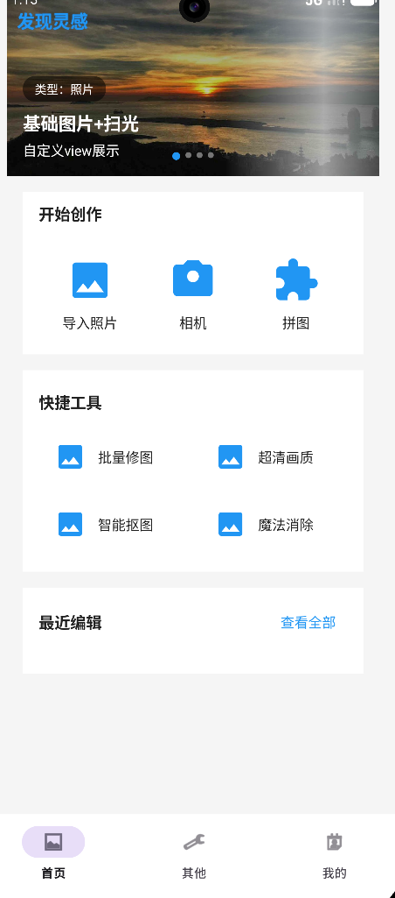
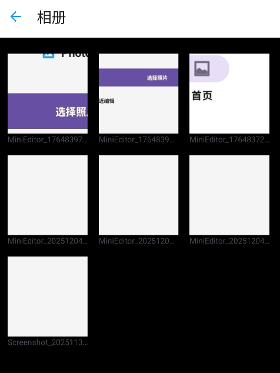
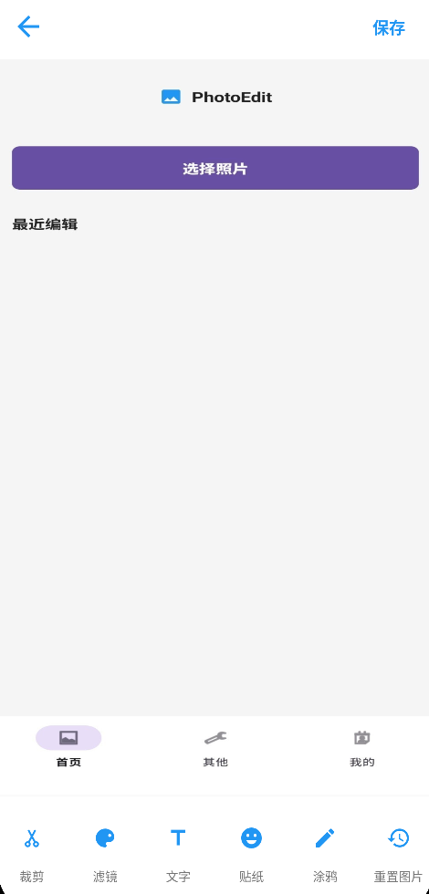
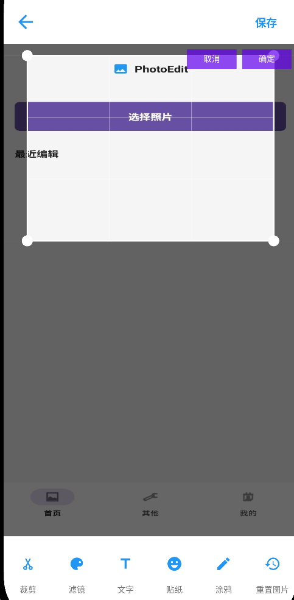
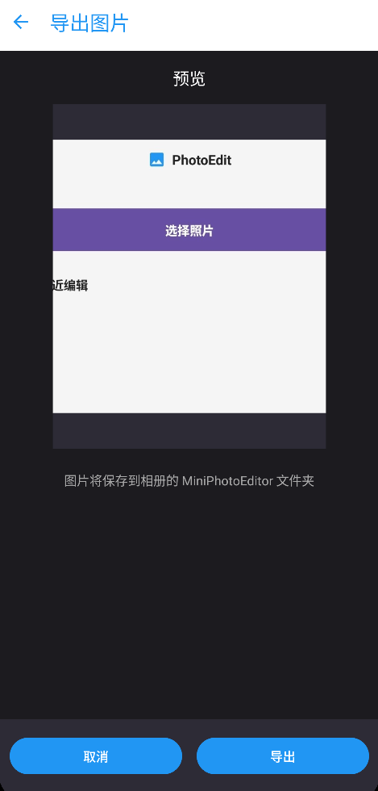

# 📸 Mini Photo Editor（Android）

## 🧩 项目简介

**Mini Photo Editor** 是一款轻量、全屏体验的 Android 照片编辑应用，基于 OpenGL ES 3.0 实现高性能图片渲染。
用户可以通过简单的手势操作对照片进行裁剪、缩放和平移，并一键导出保存至相册。
**技术栈：** Kotlin、OpenGL ES 3.0、Android Jetpack、DialogFragment。

本应用使用 `DialogFragment` 作为全屏编辑/导出容器，并适配**全面屏、刘海屏、状态栏安全触摸区域**，保证所有机型按钮可正常点击。

---

## ✨ 核心功能
| 功能模块 | 功能描述 |
| -------- | -------- |
| 主页 | 轮播广告、GIF 展示、扫光特效、跳转相册页 |
| 相册页 | 权限请求、照片预览、选择照片跳转编辑页 |
| 编辑页 | OpenGL 图片渲染、2D 手势缩放/平移、裁剪、重置位置 |
| 导出功能 | 预览导出、保存到相册 MiniPhotoEditor 目录 |
| 工程优化 | R8 压缩混淆、AAB/APK 打包 |

 

---

## 🛠️ 构建与运行说明

### 🔧 开发环境
- **JDK** 17+
- **Gradle** 8.13+
- **Android AGP 插件** 8.13.0
- **Kotlin 版本** 1.9+

---

### 运行事宜
#### 1. 克隆项目
```bash
git clone <repository-ref>
cd mini-photo-editor
```
#### 2. 在 Android Studio 中打开项目，等待 Gradle 同步完成
#### 3. 连接 Android 设备或启动模拟器
#### 4. 点击运行按钮，选择目标设备启动应用
##### 注意事项：

- 项目使用 Android 12+ API，确保设备/模拟器兼容
- 编辑页涉及照片存储权限，请在运行时允许

## 4️⃣ 运行截图


<div style="text-align: center;">
 
</div>
<div style="text-align: center;">
 
 <div style="text-align: center;">
 
 <div style="text-align: center;">
 
 <div style="text-align: center;">
 


